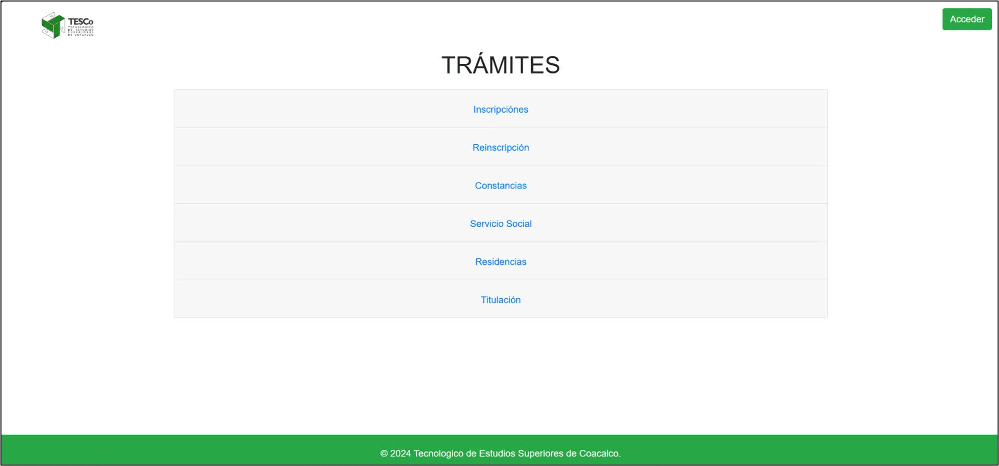
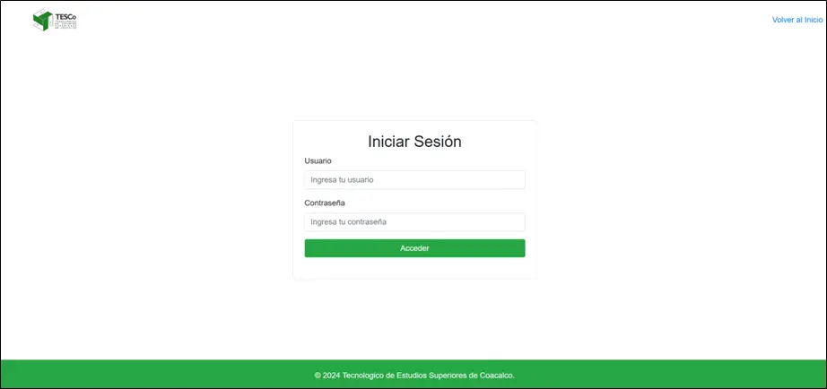
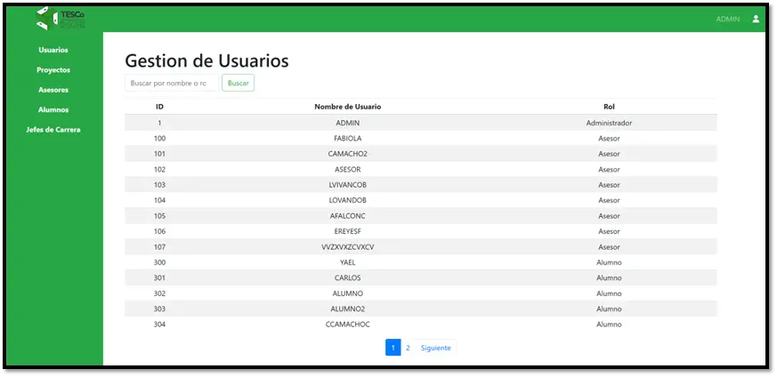
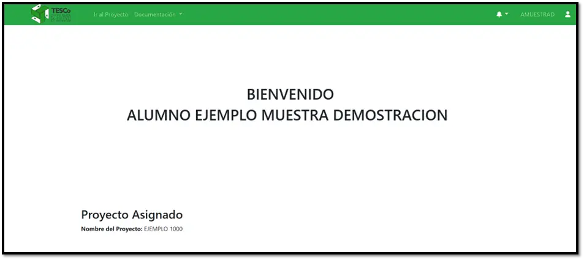
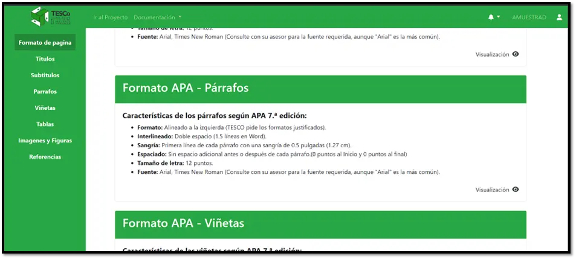
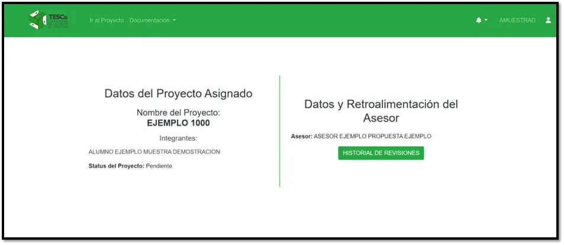
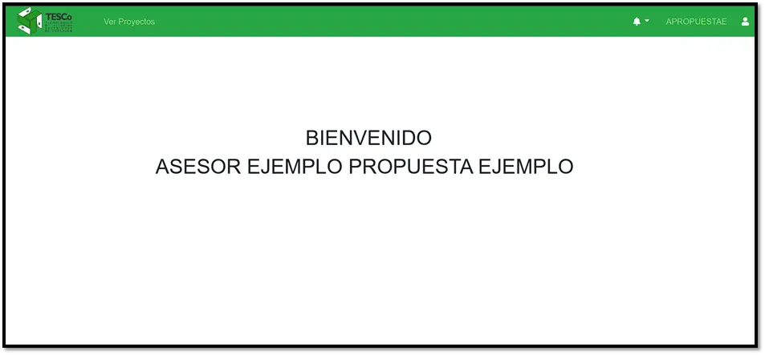
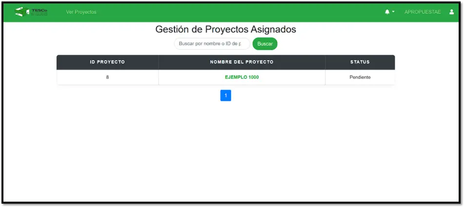
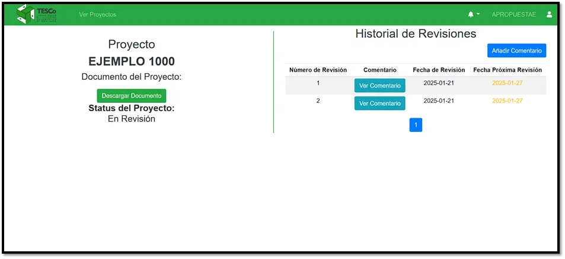

# 📘 Sistema de Información Web en PHP

Este sistema web fue desarrollado con PHP y permite la gestión de información estructurada, incluyendo funcionalidades de carga de archivos, vistas dinámicas, acceso a base de datos, y manejo de sesiones de usuario. Está diseñado para ejecutarse en servidores locales como XAMPP o LAMP.

> [!IMPORTANT]
> Si quieres tener acceso al repositorio, con el proyecto completo, contacta al administrador de este reporsitorio

---
## Vistas Principales
<p align="center">
  
  
  
</p>
<p align="center">
  
  
  
</p>
<p align="center">
  
  
  
</p>
<p align="center">
  
</p>


---

## ⚙️ Tecnologías Utilizadas

- **PHP** (probado con versiones 7.x y 8.x)
- **MySQL / MariaDB** para persistencia de datos
- **JavaScript** y **jQuery** para interactividad del lado del cliente
- **Bootstrap** para estilos responsivos (si está presente)
- **HTML5** / **CSS3**
- **Apache** (via XAMPP o LAMP)

---

## 📁 Estructura de Carpetas

```
Sistema_de_Informacion_PHP/
├── Assets/         # Recursos estáticos como imágenes, logos y hojas de estilo
├── DataBase/       # Archivo(s) .sql para creación/importación de la base de datos
├── Includes/       # Fragmentos PHP reutilizables: conexión DB, headers, validaciones
├── Scripts/        # Scripts JavaScript personalizados
├── Uploads/        # Archivos subidos por los usuarios
├── Views/          # Vistas HTML/PHP del sistema (páginas internas)
├── index.php       # Página inicial (posiblemente login o dashboard)
```

---

## ⚡ Instalación Local

1. Instala [XAMPP](https://www.apachefriends.org/) o un stack LAMP.
2. Copia el contenido del proyecto a tu carpeta `htdocs/` (XAMPP) o `www/` (LAMP).
3. Crea una base de datos en `phpMyAdmin`, por ejemplo:

```sql
CREATE DATABASE sistema_info DEFAULT CHARACTER SET utf8mb4 COLLATE utf8mb4_general_ci;
```

4. Importa el archivo `.sql` desde la carpeta `/DataBase/`.
5. Configura la conexión en `/Includes/db.php` (o archivo equivalente):

```php
$host = 'localhost';
$user = 'root';
$password = '';
$dbname = 'sistema_info';
```

6. Inicia Apache y MySQL desde XAMPP.
7. Abre tu navegador y visita:

```
http://localhost/Sistema_de_Informacion_PHP_Completo/
```

---

## ✅ Funcionalidades Principales

- Autenticación y manejo de sesiones
- Visualización dinámica de contenidos desde base de datos
- Subida de archivos al servidor (`/Uploads`)
- Separación modular de lógica y vistas (MVC simplificado)
- Diseño adaptable y reutilización de componentes con `Includes/`

---

## 🔄 Flujo General del Sistema

```
[ Usuario ]
   ⇩
[ index.php (Login o Página principal) ]
   ⇩
[ Includes/ lógica de conexión y sesión ]
   ⇩
[ Views/ diferentes módulos y pantallas ]
   ⇩
[ MySQL Base de Datos ]
```

---

## 📌 Notas

- Asegúrate de tener permisos de escritura en la carpeta `/Uploads/`
- El sistema puede ampliarse fácilmente con nuevos módulos agregando vistas y controladores
- Revisar seguridad en producción: sanitización de inputs, validación de sesión, etc.

---